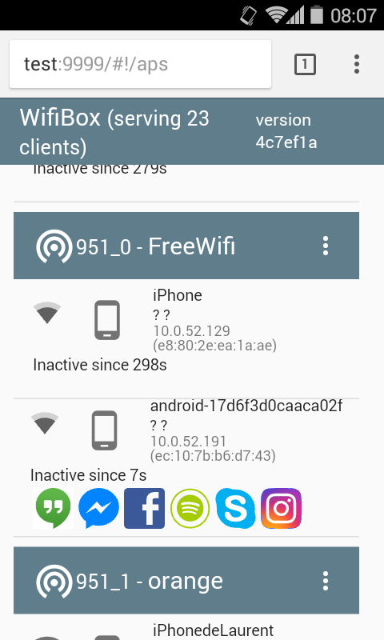
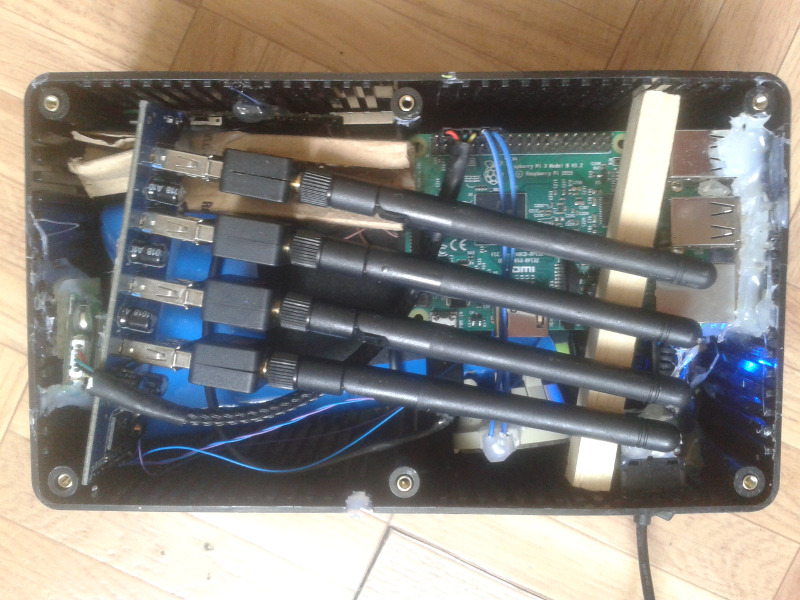
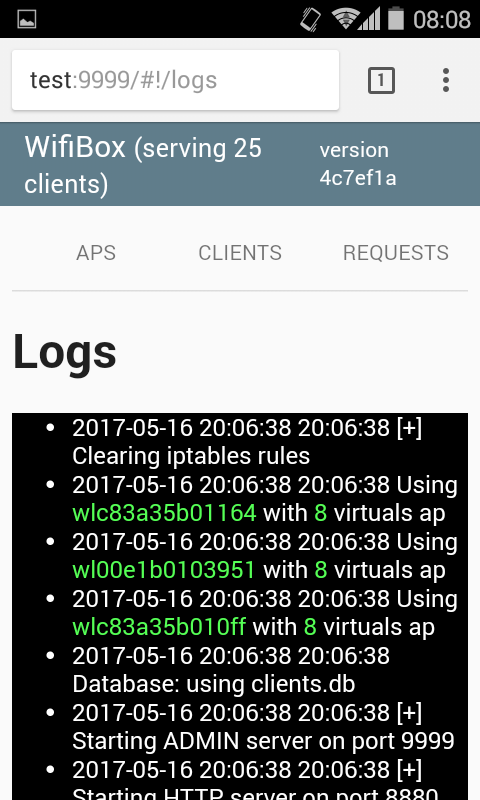
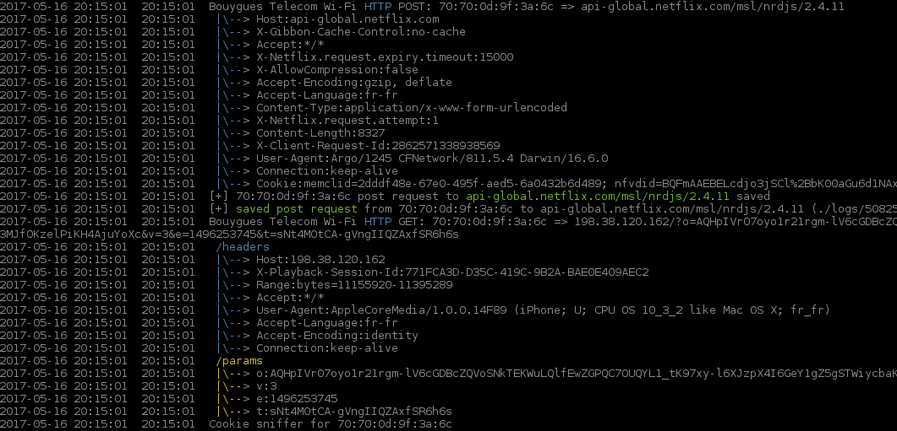
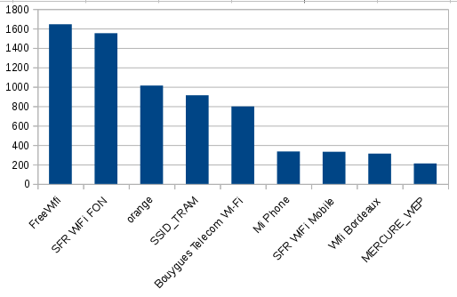
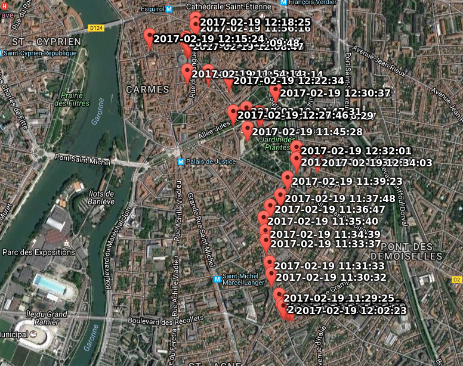

# Karma2

This is a war walking tool designed to catch all devices and grab all informations available as a man in the middle attack without any wan access. It comes with an admin web interface in order to monitor connected devices from a standard smartphone.

The aim of this project is to check how privacy and security concerns are linked, and how it is easy to get information from peoples that we are not supposed to know.




Some nice shots:

- The current song album art played in the deezer app is displayed on the webui
- Some tinder profile pictures uris ( not reproduced )
- a lot of instagram pictures uris
- DHL delivery digitalized signature
- several mail credentials
- some Firmware Over the Air (fota) servers
- some google search history ( with of course some interesting embarrassing searchs )
- some position history
- some session cookies
- some kedge credentials

## Features

### Wan access not mandatory
This tool does not requires any wan access so it can be package in a totally autonomous system even if phone and other devices believe they are connected to a real wan access. Please check the ````--offline```` option.

### Multi ssid
It autodetects the [maximum number of Access Point](http://wiki.stocksy.co.uk/wiki/Multiple_SSIDs_with_hostapd) that can be run on each wifi dongle. It is then possible to create 8 fake access point using by [3$ device](https://www.amazon.fr/dp/B00EVI3V9Y/ref=pe_386181_124266941_TE_item)

### Database
All grabbed information are stored in a local sqlite database ( credentials, services detections, http request... )

### Logging
Everything is logged in the Database, but also as standard files as for example post request data. Then you can unpack transmitted files, base64 data or try to understand binary data.
One log folder is created by session, and within you will find post request, raw tcp dump data for each access point you created and a global log file which is available in realtime through the web ui

Realtime web logging




Real time console file logging



### Security
Iptable is used to seggregate each access point and to avoid a possible client attack. Clients have only access to faked services, and only whitelisted mac address have access to the admin interface and other services such as ssh. The mac filtering is controlled by the ````--ignore```` option

### WPA half handshake
If you prefere catch wpa handshake instead of devices information, just start wpa protected access points. The device will try to connect with its own credentials. It will of course fail but you will have to handshake in your logs. Please refer to [WPA2-HalfHandshake-Crack](https://github.com/dxa4481/WPA2-HalfHandshake-Crack). You can try the ````--wpa --tcpdump```` options

### Phishing
Some phishing tests were done to grab wifi portals login depending on the current essid.
Moreover all available cookies for wellknown websites are downloaded any time a user load a fake html page from our internal webserver. You may find the complete list in the js [source file](www/phishing/js/cookie_sniffer.js)

### Probes monitoring
Using scapy or [wifiScanMap](https://github.com/mehdilauters/wifiScanMap), it is possible to create any requested essid to catch unconnected wifi clients around you. Check the ````--monitor```` option

### Dhcp
The dnsmasq dhcp module is used to give dhp leases to new connected devices

### DNS
The dnsmasq server is used to fake all DNS queries to the local web server. It also fakes the [microsoft DNS connection check](https://technet.microsoft.com/en-us/library/cc732049%28v=ws.10%29.aspx) by providing the required response to enable connectivity on windows phones.

### Webserver
All request from connected devices are routed to the internal webserver which try to fake as most as possible services APIs. Http and Https protocols are available (with a self signed certificate)
It also fakes required services to make devices ([android](https://android.stackexchange.com/questions/123129/how-does-wifi-in-android-detect-if-the-device-has-to-sign-in-or-not), [blackberry](http://www.blackberry.com/select/wifiloginsuccess/EN/)...) to believe they are connected to a real wan access.
For example, you can retrieve the currently played song on the android deezer application.
Of course all authentication method are logged (such as Basic, Oauth tokens) and cookies are stored in a firefox compatible file using the [cookie-importer](https://addons.mozilla.org/fr/firefox/addon/cookie-importer/) module.

### Ftp server
A basic ftp server which try to catch credentials

### POP3 server
A basic POP3 server which try to catch credentials

### Samba Crawler
This module tries to fetch all public data from clients samba shares

### Service and devices guessr:
These modules tries to fingerprint versions of devices and applications as for example :


## Behaviour

- A smartphone is around you and its wifi is activated but unconnected. It tries to find a known essid making probes request.
- The karma2 service cacth it and create a dedicated Access Point.
- The device then connect and already give some information through the dhcp process: its hostname.
- Depending on the OS, it may first check it has a real internet access before notify the system a connection is available. Android will check a given url for example.
- The internal webserver responds what should be and the device wake up all applications.
- Allmost all applications try to reach their respective backend, so through DNS queries, we already are able to fingerprint them.
- Most of them then shutdown as they try to reach their backend through a secure https connection and our certificate is unsecure.
- As all dns are faked, still a lot of them try to communicate through the unsecure connection we gave them (http or self signed https).
- This is now the time for the webserver to fake all application APIs to get for example, the deezer profile ID, applications and services versions...
- The access point is destroyed after a given inactivity time.

## The real life test, a 5 month experience

### Dataset

#### Date range
````
select min(timestamp), max(timestamp) from ap_connections limit  1
"Tue, 18 Oct 2016 12:03:44"	"Thu, 02 Mar 2017 07:59:23"
````

#### unique client count

````
select count(*) from ap_connections group by client_mac
3266 rows
````

### Results

Up to 40 connected devices on public transport accross 24 concurrent faked access points using a raspberry 3, and 4 wifi dongle abale to create 8 access point each.

#### Top essids
````
select ap_essid, count(*) as c from ap_connections group by ap_essid order by c desc
````



#### Android versions


#### Clients credentials
````
select count(*) from client_credentials;
9
````

Some from the outlook application itself: ````eas.outlook.com/Microsoft-Server-ActiveSync````

#### Advertising tracking
You cannot immagine all data that are sent to data brokers through all applications for advertising purpose, including:

 - carriers ( orange / sfr ... )
 - phone brand ( apple / samsung...)
 - phone revision ( samsung_GT-I8190_5.0.2_5.4.1.146 ... )
 - os version
 - orientation lock ( true / false )
 - locale ( en_EN / fr_FR ...)
 - country code (EN / FR)
 - screen orientation ( landscape / portrait )
 - screen resolution 
 - charging status ( true / false )
 - front camera available ( true / false )
 - rear camera available ( true / false )
 - microphone available ( true / false )
 - gps enabled ( true / false )
 - bluetooth enabled ( true / false )
 - network type ( lan / data )
 - application list and versions

As for example the following request to the [applovin](https://www.applovin.com/) marketing api:

````
{
  "app_info" : {
    "first_install" : "false",
    "app_name" : "iMusic",
    "applovin_sdk_version" : "3.0.2",
    "package_name" : "com.imusicamir.pro",
    "created_at" : 4142207
  },
  "stats" : {
    "ad_session_start" : 539063990.722326,
    "ad_imp" : 1,
    "ad_req" : 1083
  },
  "targeting" : {

  },
  "device_info" : {
    "orientation" : "portrait",
    "idfa" : "291B9945-F147-43C1-AB32-6A97AF650479",
    "brand" : "Apple",
    "revision" : "iPhone7,2",
    "locale" : "fr_FR",
    "os" : "10.1.1",
    "type" : "ios",
    "orientation_lock" : "none",
    "dnt" : "false",
    "model" : "iPhone",
    "carrier" : "Bouygues Telecom",
    "country_code" : "FR"
  }
}
````

Or a post request to the [databerries.com](http://databerries.com/) marketing service:



#### FOTA
Some FOTA uri checks:

 - [ospserver.net](http://fota-cloud-dn.ospserver.net:80/firmware/XEF/SM-G531F/version.xml)
 - [adsunflower.com](http://fota4hw.adsunflower.com/ota/detectdown/detectScheduleCheck.do)
 - [fotapro.com](http://api.fotapro.com/api/push/connect)

### What's next?

 - Fake more apis
 - Fake some funny APIs ( weather update, microsoft tiles news )
 - Parse more post request
 - authomatize half wpa handshake catching
 - map your clients trajectory with [WifiScanMap](https://github.com/mehdilauters/wifiScanMap/blob/master/Results.md)

 
 - implement it on a droppable esp8266 box
 
   
 - refactoring: using a sql abstraction, using a web server framework


## DISCLAIMER
This project was developped for testing and experimentation purpose only. It was used to check how far it is possible to go with such chip devices. All credentials or other informations grabbed were not used against people.

**USE IT ONLY WITH YOU OWN DEVICES AND FOR TESTING PURPOSE**

## How to setup

````
 # init submodules
 git submodule update --init --recursive

 # setup dependencies
 apt install python-scapy hostapd smbclient python-impacket nmap iptables tcpdump dnsmasq aircrack-ng smbclient npm
 pip install user-agents

 # setup web ui dependencies
 cd www
 npm install -g bower
 bower install
 
 # run
 python2.7 run.py --gateway 192.168.1.1 --tcpdump --monitor mon0 --hostapds wlan0 --offline --ignore YOUR_MAC_ADDRESS -p 9999
 
 # enjoy
 # please go to http://your_ip:9999
 # go to http://your_ip:9999/images.html to display queried images ( you may have some fun )
 # go to http://your_ip:9999/requests.html to get requests list and replay them with their header
````

### Troubleshootings:
 - the webui is incomplete: please check that you already install dependencies as previously describen
 - you cannot access to the webui or ssh: if you are connected through the faked wifi, check that you set the ````--ignore```` option with your mac address to pass the mac filtering
