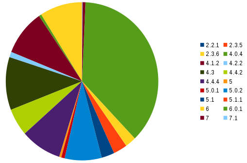

# Karma2

This is a war walking tool designed to catch all devices and grab all informations available without any wan access. It comes with an admin web interface in order to monitor connected devices from a standard smartphone.


Some nice shots:

- The current song played in the deezer app can be known
- Some tinder profile pictures uris ( not reproduced )
- a lot of instagram pictures uris
- DHL delivery digitalized signature
- several mail credentials
- some Firmware Over the Air (fota) servers

## Features

### Multi ssid
It autodetects the [maximum number of Access Point](http://wiki.stocksy.co.uk/wiki/Multiple_SSIDs_with_hostapd) that can be run on each wifi dongle. It is then possible to create 8 fake access point using by [3$ device](https://www.amazon.fr/dp/B00EVI3V9Y/ref=pe_386181_124266941_TE_item)

### Database
All grabbed information are stored in a local sqlite database ( credentials, services detections, http request... )

### Security
Iptable is used to seggregate each access point and to avoid a possible client attack. Clients have only access to faked services, and only whitelisted mac address have access to the admin interface and other services such as ssh.

### WPA half handshake
If you prefere catch wpa handshake instead of devices information, just start wpa protected access points. The device will try to connect with its own credentials. It will of course fail but you will have to handshake in your logs. Please refer to [WPA2-HalfHandshake-Crack](https://github.com/dxa4481/WPA2-HalfHandshake-Crack)

### Phishing
Some phishing tests were done to grab wifi portals login depending on the current essid

### Probes monitoring
Using scapy or [wifiScanMap](https://github.com/mehdilauters/wifiScanMap), it is possible to create any requested essid to catch unconnected wifi clients around you

### Dhcp
The dnsmasq dhcp module is used to give dhp leases to new connected devices

### DNS
The dnsmasq server is used to fake all DNS queries to the local web server. It also fakes the [microsoft DNS connection check](https://technet.microsoft.com/en-us/library/cc732049%28v=ws.10%29.aspx) by providing the required response to enable connectivity on windows phones.

### Webserver
All request from connected devices are routed to the internal webserver which try to fake as most as possible services APIs. Http and Https protocols are available (with a self signed certificate)
It also fakes required services to make devices ([android](https://android.stackexchange.com/questions/123129/how-does-wifi-in-android-detect-if-the-device-has-to-sign-in-or-not), [blackberry](http://www.blackberry.com/select/wifiloginsuccess/EN/)...) to believe they are connected to a real wan access.
For example, you can retrieve the currently played song on the android deezer application.
Of course all authentication method are logged (such as Basic) and cookies are stored in a firefox compatible file using the [cookie-importer](https://addons.mozilla.org/fr/firefox/addon/cookie-importer/) module.

### Ftp server
A basic ftp server which try to catch credentials

### POP3 server
A basic POP3 server which try to catch credentials

### Samba Crawler
This module tries to fetch all public data from clients samba shares

### Service and devices guessr:
These modules tries to fingerprint versions of devices and applications

## Behaviour

- A smartphone is around you and its wifi is activated but unconnected. It tries to find a known essid making probes request.
- The karma2 service cacth it and create a dedicated Access Point.
- The device then connect and already give some information through the dhcp process: its hostname.
- Depending on the OS, it may first check it has a real internet access before notify the system a connection is available. Android will check a given url for example.
- The internal webserver responds what should be and the device wake up all applications.
- Allmost all applications try to reach their respective backend, so through DNS queries, we already are able to fingerprint them.
- Most of them then shutdown as they try to reach their backend through a secure https connection and our certificate is unsecure.
- As all dns are faked, still a lot of them try to communicate through the unsecure connection we gave them (http or self signed https).
- This is now the time for the webserver to fake all application APIs to get for example, the deezer profile ID, applications and services versions...
- The access point is destroyed after a given inactivity time.

## The real life test

### Dataset

#### Date range
````
select min(date), max(date) from ap_connections limit  1
````

"Fri Dec  9 07:16:58 2016"	"Wed Oct 19 09:11:54 2016"

#### unique client count

````
select count(*) from ap_connections group by client_mac
````

3266 rows

### Results

Up to 24 concurrent fake essids

#### Top essids
select ap_essid, count(*) as c from ap_connections group by ap_essid order by c desc


#### Android versions



#### Clients credentials
````
select count(*) from client_credentials;
````
9
Some from the outlook application itself: eas.outlook.com/Microsoft-Server-ActiveSync

#### FOTA
Some FOTA uri checks:

 - [ospserver.net](http://fota-cloud-dn.ospserver.net:80/firmware/XEF/SM-G531F/version.xml)
 - [adsunflower.com](http://fota4hw.adsunflower.com/ota/detectdown/detectScheduleCheck.do)
 - [fotapro.com](http://api.fotapro.com/api/push/connect)

## DISCLAIMER
This project was developped for testing and experimentation purpose only. It was used to check how far it is possible to go with such chip devices. All credentials or other informations grabbed were not used.

**USE IT ONLY WITH YOU OWN DEVICES AND FOR TESTING PURPOSE**

## How to setup

````
 apt install python-scapy hostapd smbclient
 pip install impacket
 pip install user-agents
 cd www
 bower install
 npm install
````